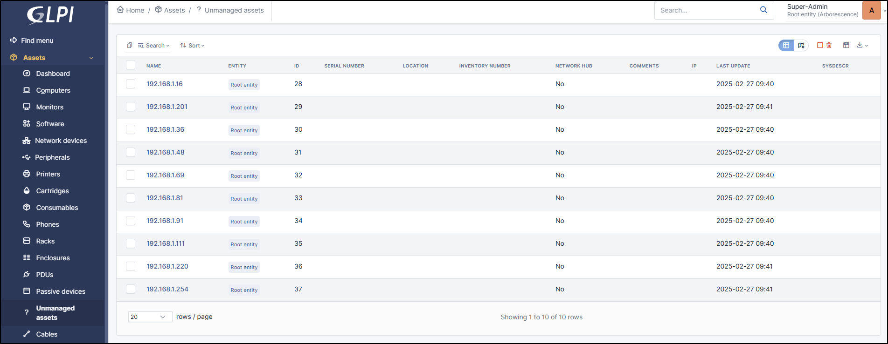
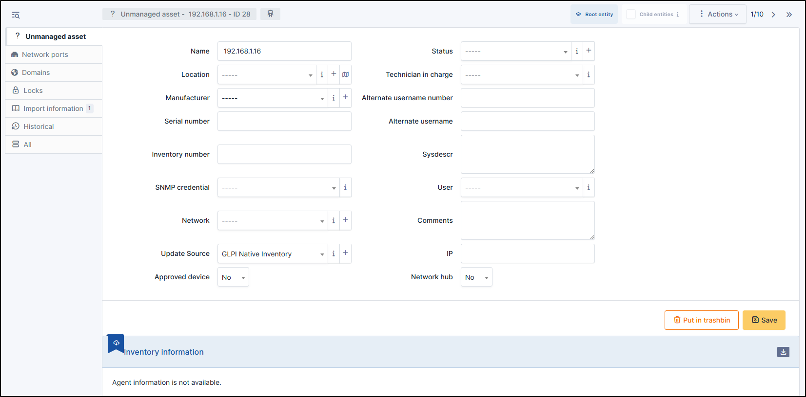
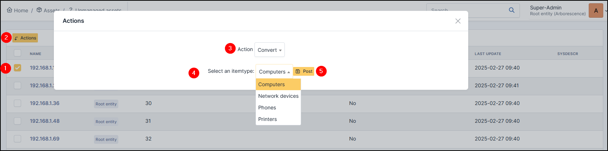

Unmanaged assets
================

Unmanaged equipment is equipment that is not directly administered by a GLPI agent or a protocol such as SNMP, WMI, etc.
Unlike managed equipment, it does not automatically report information and must be manually updated in the inventory.
These devices have been detected during a network discovery and can be converted into another type of object, either manually or via SNMP feedback.

.. tip:: Note that if you modify a field manually, it will be considered locked.
          This will prevent it from being modified the next time the automatic inventory is uploaded.

          For more information, see :doc:`lock </modules/configuration/locks>`

In a unmanaged asset form, the following information is available:

* Name
* :doc:`Location </tabs/common_fields/location>`
* :doc:`Manufacturer </tabs/common_fields/manufacturer>`
* :doc:`Serial number </tabs/common_fields/serial_number>`
* :doc:`Inventory number </tabs/common_fields/inventory_number>`
* :doc:`SNMP Credentials </tabs/common_fields/SNMP_credentials>`
* :doc:`Network </tabs/common_fields/network>`
* :doc:`Update source </tabs/common_fields/update_source>`
* Approved device: Yes / No
* :doc:`Status </tabs/common_fields/status>`
* :doc:`Technician in charge </tabs/common_fields/technician_in_charge>`
* :doc:`Alternate usernmame number </tabs/common_fields/alternate_username>`
* :doc:`Alternate usernmame </tabs/common_fields/alternate_user>`
* :doc:`Sysdescr </tabs/common_fields/sysdescr>`
* :doc:`User </tabs/common_fields/user>`
* :doc:`Comments </tabs/common_fields/comments>`
* IP
* Network hub: Yes/No

Network Ports
-------------

This tab allows to manage the :doc:`network ports <../../tabs/network_ports>` attached to the item.
The information that can be viewed is:

* Name
* Port number
* MTU
* Speed
* Internal status
* Last change
* Number of I/O bytes
* Number of I/O errors
* Duplex
* VLAN
* Connected to
* Connection
* Deleted

Domains
-------

You can attach :doc:`Domains </modules/management/domains>` to the current item. Domains are also linked to other objects such as records, problems, etc.

Locks
-----

:doc:`Locks </modules/assets/tabs/locks>` are used to prevent a field from being modified when the inventory is uploaded.
You can lock/unlock the fields you wish in a GLPI object.

Import information
------------------

Import information is information that is uploaded and governed by equipment import rules
(Administration > Rules > Rules for import and link equipments)

.. include:: ../tabs/historical.rst

.. include:: ../tabs/all.rst

Particularity
-------------

Massive actions
~~~~~~~~~~~~~~~

This item has a specific massive action which allows it to be converted into another type of object (computer, printer, etc.).

You can convert it manually via this massive action, or report it via SNMP, WMI, etc.

